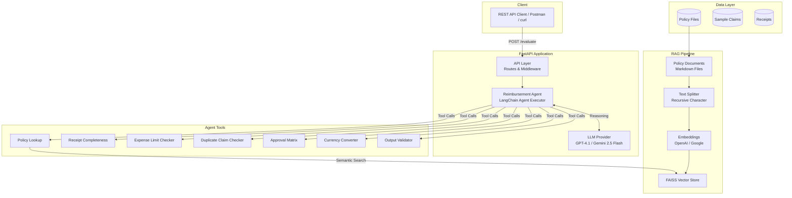
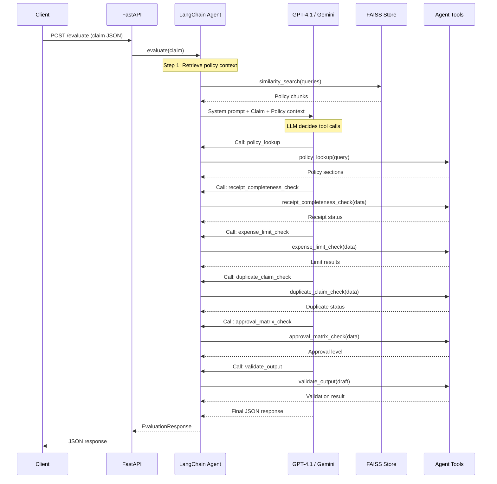
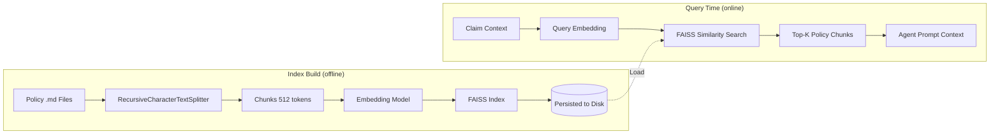
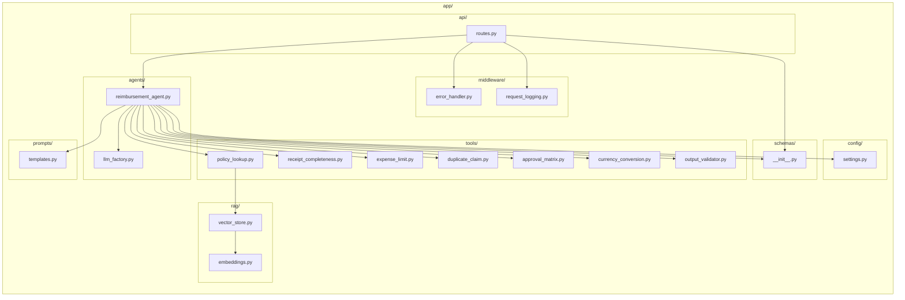
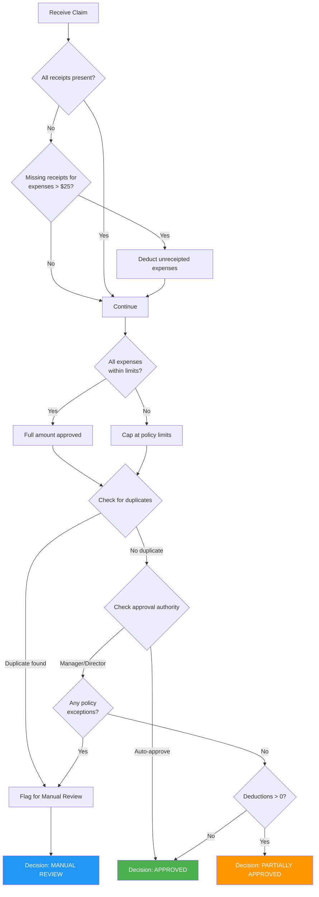

# Architecture Documentation

## High-Level Architecture

```mermaid
graph TB
    subgraph Client
        A[REST API Client / Postman / curl]
    end
    
    subgraph "FastAPI Application"
        B[API Layer<br/>Routes & Middleware]
        C[Reimbursement Agent<br/>LangChain Agent Executor]
        D[LLM Provider<br/>GPT-4.1 / Gemini 2.5 Flash]
    end
    
    subgraph "Agent Tools"
        T1[Policy Lookup]
        T2[Receipt Completeness]
        T3[Expense Limit Checker]
        T4[Duplicate Claim Checker]
        T5[Approval Matrix]
        T6[Currency Converter]
        T7[Output Validator]
    end
    
    subgraph "RAG Pipeline"
        E[Policy Documents<br/>Markdown Files]
        F[Text Splitter<br/>Recursive Character]
        G[Embeddings<br/>OpenAI / Google]
        H[FAISS Vector Store]
    end
    
    subgraph "Data Layer"
        I[(Policy Files)]
        J[(Sample Claims)]
        K[(Receipts)]
    end
    
    A -->|POST /evaluate| B
    B --> C
    C -->|Tool Calls| T1 & T2 & T3 & T4 & T5 & T6 & T7
    C <-->|Reasoning| D
    T1 -->|Semantic Search| H
    E --> F --> G --> H
    I --> E
```

## Agent Flow — Sequence Diagram

```mermaid
sequenceDiagram
    participant Client
    participant API as FastAPI
    participant Agent as LangChain Agent
    participant LLM as GPT-4.1 / Gemini
    participant RAG as FAISS Store
    participant Tools as Agent Tools

    Client->>API: POST /evaluate (claim JSON)
    API->>Agent: evaluate(claim)
    
    Note over Agent: Step 1: Retrieve policy context
    Agent->>RAG: similarity_search(queries)
    RAG-->>Agent: Policy chunks
    
    Agent->>LLM: System prompt + Claim + Policy context
    
    Note over LLM: LLM decides tool calls
    
    LLM->>Agent: Call: policy_lookup
    Agent->>Tools: policy_lookup(query)
    Tools-->>Agent: Policy sections
    
    LLM->>Agent: Call: receipt_completeness_check
    Agent->>Tools: receipt_completeness_check(data)
    Tools-->>Agent: Receipt status
    
    LLM->>Agent: Call: expense_limit_check
    Agent->>Tools: expense_limit_check(data)
    Tools-->>Agent: Limit results
    
    LLM->>Agent: Call: duplicate_claim_check
    Agent->>Tools: duplicate_claim_check(data)
    Tools-->>Agent: Duplicate status
    
    LLM->>Agent: Call: approval_matrix_check
    Agent->>Tools: approval_matrix_check(data)
    Tools-->>Agent: Approval level
    
    LLM->>Agent: Call: validate_output
    Agent->>Tools: validate_output(draft)
    Tools-->>Agent: Validation result
    
    LLM-->>Agent: Final JSON response
    Agent-->>API: EvaluationResponse
    API-->>Client: JSON response
```

## RAG Pipeline Flow

```mermaid
flowchart LR
    subgraph "Index Build (offline)"
        A[Policy .md Files] --> B[RecursiveCharacterTextSplitter]
        B --> C[Chunks 512 tokens]
        C --> D[Embedding Model]
        D --> E[FAISS Index]
        E --> F[(Persisted to Disk)]
    end
    
    subgraph "Query Time (online)"
        G[Claim Context] --> H[Query Embedding]
        H --> I[FAISS Similarity Search]
        I --> J[Top-K Policy Chunks]
        J --> K[Agent Prompt Context]
    end
    
    F -.->|Load| I
```

## Component Diagram

```mermaid
graph LR
    subgraph "app/"
        subgraph "api/"
            R[routes.py]
        end
        subgraph "agents/"
            AG[reimbursement_agent.py]
            LF[llm_factory.py]
        end
        subgraph "tools/"
            T1[policy_lookup.py]
            T2[receipt_completeness.py]
            T3[expense_limit.py]
            T4[duplicate_claim.py]
            T5[approval_matrix.py]
            T6[currency_conversion.py]
            T7[output_validator.py]
        end
        subgraph "rag/"
            VS[vector_store.py]
            EM[embeddings.py]
        end
        subgraph "config/"
            S[settings.py]
        end
        subgraph "schemas/"
            SC[__init__.py]
        end
        subgraph "middleware/"
            EH[error_handler.py]
            RL[request_logging.py]
        end
        subgraph "prompts/"
            PT[templates.py]
        end
    end
    
    R --> AG
    AG --> LF
    AG --> T1 & T2 & T3 & T4 & T5 & T6 & T7
    AG --> PT
    T1 --> VS
    VS --> EM
    AG --> SC
    R --> SC
    R --> EH & RL
    AG --> S
```

## Decision Flow

```mermaid
flowchart TD
    A[Receive Claim] --> B{All receipts present?}
    B -->|No| C{Missing receipts for<br/>expenses > $25?}
    C -->|Yes| D[Deduct unreceipted expenses]
    C -->|No| E[Continue]
    B -->|Yes| E
    
    D --> E
    E --> F{All expenses<br/>within limits?}
    F -->|Yes| G[Full amount approved]
    F -->|No| H[Cap at policy limits]
    
    G --> I{Check for duplicates}
    H --> I
    
    I -->|Duplicate found| J[Flag for Manual Review]
    I -->|No duplicate| K{Check approval authority}
    
    K -->|Auto-approve| L[Decision: APPROVED]
    K -->|Manager/Director| M{Any policy<br/>exceptions?}
    
    M -->|Yes| J
    M -->|No| N{Deductions > 0?}
    
    N -->|Yes| O[Decision: PARTIALLY APPROVED]
    N -->|No| L
    
    J --> P[Decision: MANUAL REVIEW]
    
    style L fill:#4CAF50,color:#fff
    style O fill:#FF9800,color:#fff
    style P fill:#2196F3,color:#fff
```
